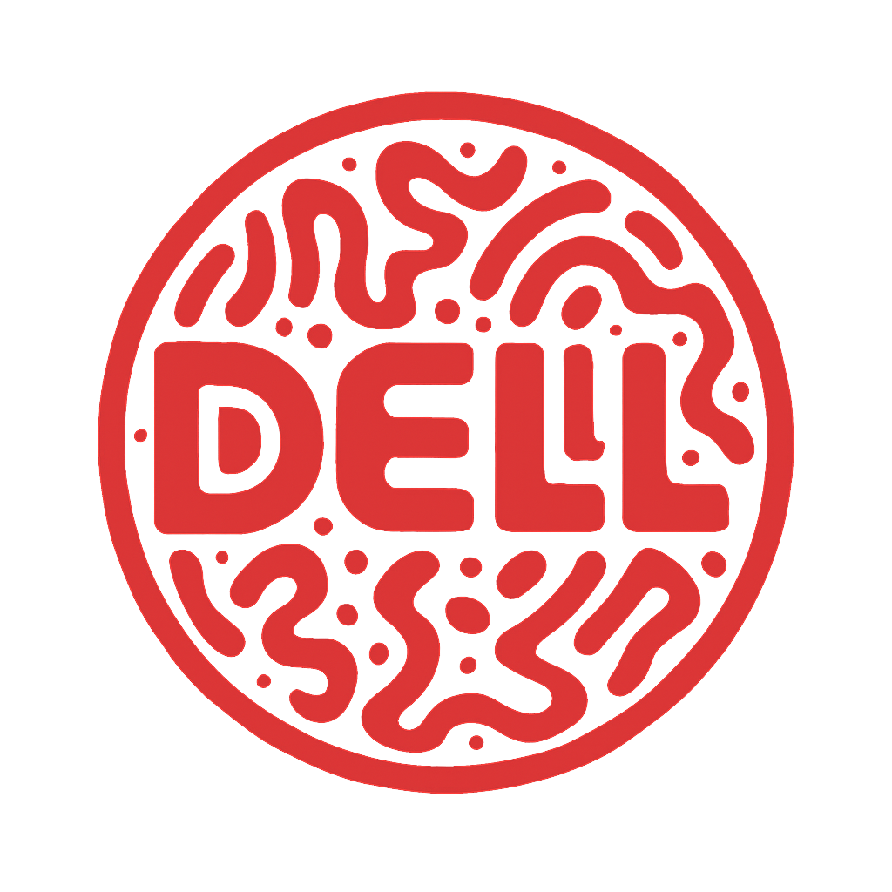

  

 

### 💻 Professional Web Developer From Indonesia

Creating modern, responsive, and user-friendly websites  
with clean design and efficient backend systems.

 

---

# 🚀 About Me

💡 Passionate about building modern web applications  
and continuously improving development skills.

⚡ Experienced with frontend & backend development  
using modern web technologies.

🎯 Focused on creating clean UI, responsive layouts,  
and functional web systems.

 

---

# 🌐 Portfolio

 

---

# ⚡ Tech Stack

 

---

# 🔥 Contribution Streak

 

---

# 🌌 Activity Graph

 

---

# 🌐 Connect With Me

 

---

# 💭 Developer Quote

> “Keep building. Keep learning. Keep improving.”

 

---

 

